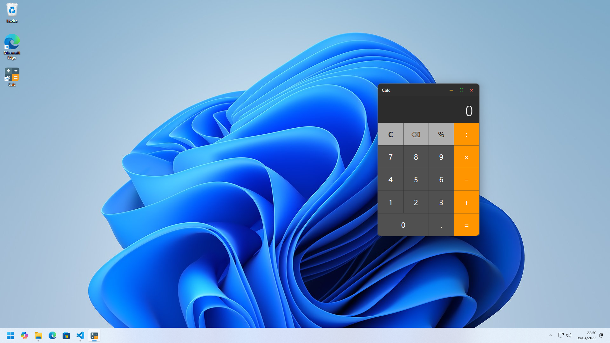
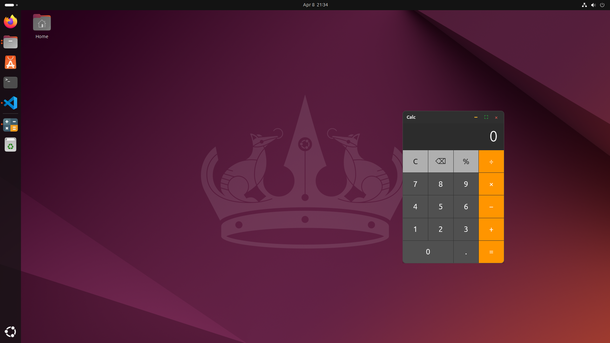

# Tauri Calc

A clean, modern, and cross-platform calculator application built with Tauri, React, and Rust following Clean Architecture principles.

  
  


## About The Project

This is a desktop calculator built with Tauri, created as a study project to learn how Tauri works and how it connects Rust, React, and TypeScript. It also helps to understand how to build apps that run on Windows 10/11, macOS, and Linux.

The project follows Clean Architecture principles, which makes the code easier to maintain, test, and improve over time.

The calculator has a modern design with custom window controls, giving a native feel on all systems. All calculations are done safely in the Rust backend using the meval library to evaluate expressions.

## Features

- Standard arithmetic operations: Addition (+), Subtraction (-), Multiplication (×), Division (÷)
- Percentage (%) calculations
- Decimal point input with automatic "0" prefixing (e.g., "5/.3" becomes "5/0.3")
- Arbitrary precision for large integer operations (using BigInt)
- Precise floating-point handling (e.g., "0.1 + 0.2" correctly yields "0.3")
- Proper error handling for division by zero with specific error message
- Clear (C) and Backspace functionality
- Responsive display with dynamic font sizing based on actual text width
- Complete keyboard support, including Numpad and function keys
- Visual feedback for keyboard input
- Custom title bar with window controls (Minimize, Maximize/Restore, Close)
- Window dragging via the title bar
- Window resizing via edge dragging
- Clipboard integration (Copy/Paste)
- Right-click context menu
- Cross-platform compatibility (Windows, macOS, Linux)

## Architecture

The application follows Clean Architecture principles, with clear separation of concerns:

- **Domain Layer**: Core business logic and entities  
- **Use Cases Layer**: Application-specific business rules  
- **Infrastructure Layer**: External interfaces and technical implementations  
- **Presentation Layer**: UI components and user interaction

## Tech Stack

- **Framework**: [Tauri (v2)](https://tauri.app/)  
- **Backend**:
  - **Language**: [Rust](https://www.rust-lang.org/)
  - **Expression Evaluation**: [meval](https://crates.io/crates/meval)
  - **Arbitrary Precision**: [num-bigint](https://crates.io/crates/num-bigint)
- **Frontend**:
  - **Framework**: [React](https://reactjs.org/)
  - **Build Tool**: [Vite](https://vitejs.dev/)
  - **Language**: [TypeScript](https://www.typescriptlang.org/)
- **Testing**:
  - **Frontend**: Jest + Testing Library
  - **Backend**: Rust's built-in test framework

## Platform Support

Built with Tauri, this application runs natively on:

- **Windows** 10/11  
- **macOS** 
- **Linux** (.deb and .rpm)

Pre-built installers for all platforms are available in the [Installers](./Installers/) folder.


## Development Setup

### Prerequisites

- [Node.js](https://nodejs.org/) (v18 or higher)  
- [Rust & Cargo](https://www.rust-lang.org/tools/install) (2021 edition)

#### Windows

- Microsoft Visual C++ Build Tools (instalado com o Rust via rustup)  
- WebView2 Runtime

#### macOS

- Xcode Command Line Tools

#### Linux (Ubuntu 24.04)

On Ubuntu 24.04, the following packages are required:

```bash
sudo apt-get install -y build-essential curl wget libssl-dev libgtk-3-dev \ 
libayatana-appindicator3-dev librsvg2-dev libglib2.0-dev \
libjavascriptcoregtk-4.1-dev libsoup-3.0-dev libwebkit2gtk-4.1-dev
```


### Installation

If you just want to download the app to test it, installers for Windows, macOS, and Linux are available in the [Installers](./Installers/) folder.

To run it as a developer:

1. Clone the repository:
   ```bash
   git clone https://github.com/viniciusbuscacio/Tauri-Calc.git
   cd Tauri-Calc
   ```

2. Install dependencies:
   ```bash
   npm install
   ```

3. Start the development server:
   ```bash
   npm run tauri dev
   ```

## Building for Production

To create distributable application bundles:

```bash
npm run tauri build
```

This command generates platform-specific installers in `src-tauri/target/release/bundle/`:
* Windows: `.msi` installer
* macOS: `.dmg` and `.app` bundle
* Linux: `.deb` and `.rpm`


## Testing

Run the test suite:

```bash
npm test
```

Run tests with coverage reporting:

```bash
npm run test:coverage
```

## License

Distributed under the MIT License. See `LICENSE` file for more information.

